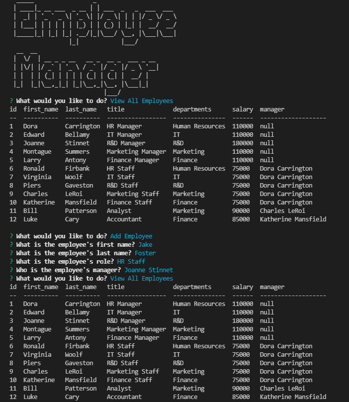

# Employee Manager

## Description

This application provides users the visual ability to Create, Read, Update, and Delete Employees, Roles, and Department vai CLI.

## Demo

[View Live Site Here](https://github.com/Charlton-H/employee-tracker)
[View Video Demo](https://drive.google.com/file/d/1MeGNprdlUq--ooqxHX1AVsHs6YvgQh7p/view?usp=sharing)

## Built With

## Table of Contents

- [Installation](#Installation)
- [License](#License)

## Installation

Prior to running, user should install MySQL database and run `npm install`

## License

### &copy; 2022 Charlton H
